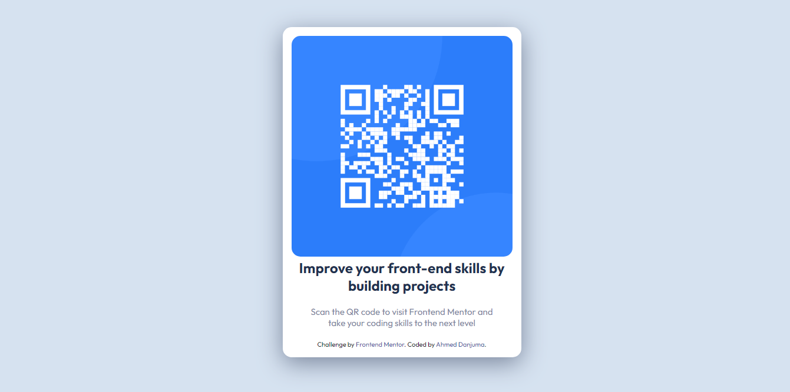

# Frontend Mentor - QR code component solution

This is a solution to the [QR code component challenge on Frontend Mentor](https://www.frontendmentor.io/challenges/qr-code-component-iux_sIO_H). Frontend Mentor challenges help you improve your coding skills by building realistic projects. 

## Table of contents

- [Overview](#overview)
  - [Screenshot](#screenshot)
  - [Links](#links)
- [My process](#my-process)
  - [Built with](#built-with)
  - [What I learned](#what-i-learned)
  - [Continued development](#continued-development)
  - [Useful resources](#useful-resources)
- [Author](#author)
- [Acknowledgments](#acknowledgments)


## Overview

### Screenshot



### Links

- Solution URL: [](https://github.com/AhmedDanjuma/Frontend-Mentor-Solution-qr-code-component-using-HTML-CSS)
- Live Site URL: [](https://ahmeddanjuma.github.io/Frontend-Mentor-Solution-qr-code-component-using-HTML-CSS/)

## My process
I used HTML, CSS and Flexbox in CSS to build this project. I also used relevant websites to look up how to do use certain css properties.
### Built with

- Semantic HTML5 markup
- CSS custom properties
- Flexbox

### What I learned

- I learnt how to import online font styles into my CSS file.
- I learnt how to vertically and horizontally center a div in CSS using Flexbox


```css
.proud-of-this-css {
  @import url('https://fonts.googleapis.com/css2?family=Outfit:wght@400;700&display=swap');
}
.proud-of-this-too {
  align-items: center;
  display: flex;
  justify-content: center;
}
```

### Continued development

- Flexbox

### Useful resources

- [Example resource 1](https://www.w3schools.com) - This helped me for alot of things. I recommend this for beginner developers
- [Example resource 2](https://www.google.com) - You need this for everything

## Author

- Website - [Add your name here](https://www.your-site.com)
- Frontend Mentor - [@AhmedDanjuma](https://www.frontendmentor.io/profile/AhmedDanjuma)
- Twitter - [@yourusername](https://www.twitter.com/yourusername)

## Acknowledgments

Thank you [Steven](https://github.com/valleyman89)
